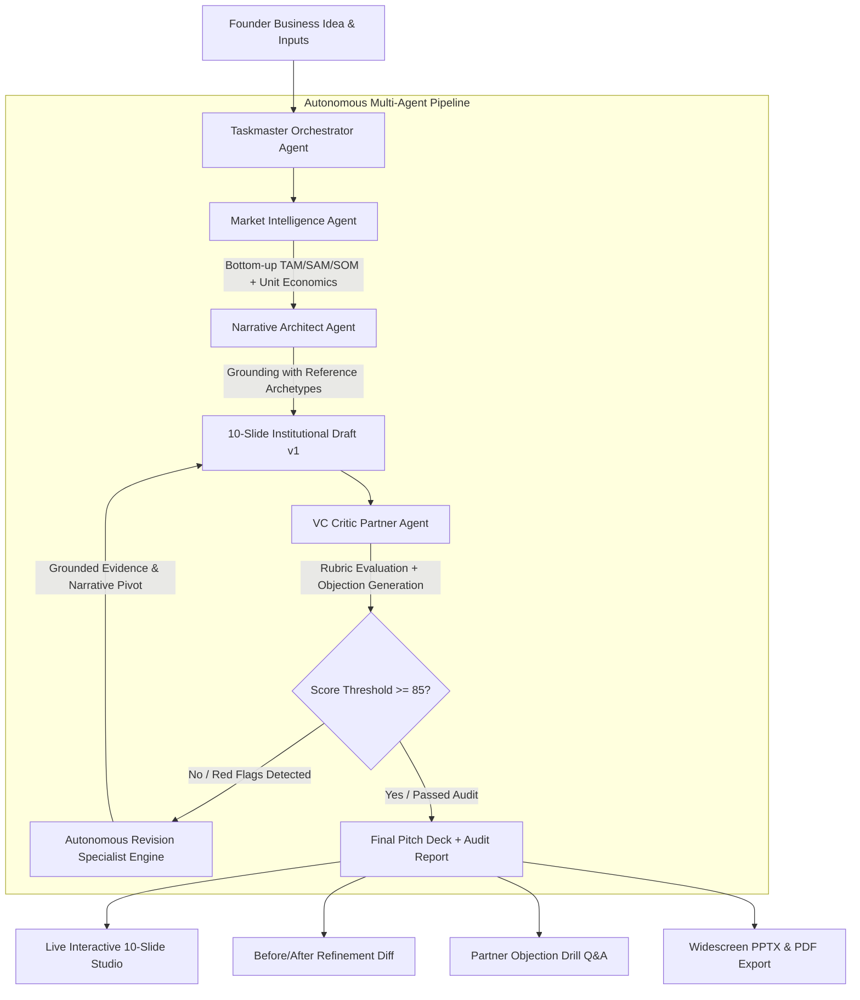

<div align="center">

# ⚡ PitchArchitect AI

### **Autonomous Multi-Agent Pitch Deck Studio & VC Audit Engine**

[](https://react.dev/)
[](https://www.typescriptlang.org/)
[](https://vitejs.dev/)
[](#-multi-agent-system-architecture)
[](#-production-grade-export)
[](LICENSE)

<br />

**PitchArchitect AI** is an institutional-grade platform that generates investor-ready 10-slide pitch decks from raw founder ideas. It replaces generic AI text generation with an **autonomous multi-agent swarm** that performs bottom-up market sizing calculations, grounds narrative structures against historical archetypes (Airbnb, Uber, Sequoia), and stress-tests every slide against tough simulated VC Partner critic personas.

---

</div>

## ✨ Key Highlights

- **🧠 5-Agent Collaborative Swarm**: Autonomous orchestration between Market Researcher, Narrative Architect, VC Critic, Revision Engine, and Taskmaster.
- **📐 Grounded Bottom-Up Arithmetic**: Eliminates hallucinated market metrics with mathematically defended TAM, SAM, and SOM calculations based on target account density and ACVs.
- **🛡️ 4 Simulated VC Partner Personas**: Stress-tests every slide against *SaaS Skeptics*, *Fintech Hawks*, *Deeptech Purists*, and *Consumer Growth* partners.
- **📈 5-Dimension Institutional Rubric**: Instant institutional readiness scoring (/100) across Market Opportunity, Defensibility, Unit Economics, GTM Clarity, and Capital Ask.
- **🔄 Autonomous Self-Correction & Refinement Diff**: Automated feedback loop that identifies weak claims and autonomously revises slides to increase investor readiness scores.
- **📚 Curated Archetypes & PDF Deck Ingestion**: Ground decks against 9 historical seed decks (Airbnb, Uber, Stripe, etc.) or upload custom pitch PDFs for client-side indexing.
- **📊 Native 16:9 PPTX & PDF Export**: Instant export to Microsoft PowerPoint (`.pptx`) and vector PDF (`.pdf`) preserving all formatting and typography.
- **🎨 Editorial Poster Design System**: Electric Cobalt (`#4D44FF`) & Pastel Blush Pink (`#FFCCD5`) editorial aesthetics powered by `Bebas Neue`, `Syne`, `Space Grotesk`, and `Space Mono`.

---

## 🤖 Multi-Agent System Architecture



---

## 👥 The Autonomous Agent Swarm

| Agent Role | Responsibility | Key Output |
| :--- | :--- | :--- |
| **Taskmaster Orchestrator** | Coordinates execution DAG, manages state, and tracks execution latency | Pipeline orchestration stream & durations |
| **Market Intelligence Agent** | Computes beachhead unit counts, ACVs, CAGRs, and unit economics | Defended TAM/SAM/SOM calculations |
| **Narrative Architect** | Constructs 10-slide standard sequence with clear narrative progression | 10 structured slide templates |
| **VC Critic Partner** | Evaluates deck against 5-dimension rubric and generates tough partner objections | Scorecards (/100) & partner meeting drill Q&As |
| **Autonomous Revision Specialist** | Modifies weak slides to address objections and boost readiness | Side-by-side before/after diffs (+pts delta) |

---

## 🎯 10-Slide Standard Outline

Every generated pitch deck follows the institutional 11-point standard structure:

1. **Problem**: Quantified customer pain points, annual loss metrics, and urgency triggers.
2. **Solution**: Core capability pillars, architectural workflows, and proprietary moats.
3. **Market Sizing (TAM/SAM/SOM)**: Verified bottom-up arithmetic ($ACV \times \text{Beachhead Units}$) and CAGR.
4. **Business Model**: Pricing tiers, gross margins (>80%), LTV:CAC ratios, and payback horizons.
5. **Competitive Defensibility**: Incumbent matrix analysis and 3 defensive moat pillars.
6. **Go-To-Market (GTM)**: Multi-channel customer acquisition split and 3-phase execution roadmap.
7. **Team & Pedigree**: Founder superpowers, previous exits/affiliations, and executive advisory board.
8. **Financial Forecast**: 3-year revenue projections, expense breakdown, and cash-flow breakeven timeline.
9. **Traction & Validation**: Operational KPIs, growth metrics, and customer case study validation.
10. **The Funding Ask**: Target capital injection, runway duration (18-24 months), and milestone allocation.

---

## 🛠️ Technology Stack

- **Frontend Core**: React 19, TypeScript, Vite 6
- **Styling**: Vanilla CSS & TailwindCSS design tokens (`Syne`, `Bebas Neue`, `Space Mono`, `Plus Jakarta Sans`)
- **Presentations & Document Generation**: `pptxgenjs` (Widescreen 16:9), `jspdf`, `html2canvas`
- **PDF Extraction & Indexing**: `pdfjs-dist` (Client-side worker parsing)
- **Visual Micro-Interactions**: `lucide-react`, `canvas-confetti`
- **Quality & Linting**: Oxlint

---

## 🚀 Getting Started

### Prerequisites

- **Node.js** `>= 18.0.0`
- **npm** `>= 9.0.0` or **pnpm** / **yarn**

### Installation

1. **Clone the repository**:
   ```bash
   git clone https://github.com/M0izz/Pitch-Deck-AI.git
   cd Pitch-Deck-AI
   ```

2. **Install dependencies**:
   ```bash
   npm install
   ```

3. **Start the local development server**:
   ```bash
   npm run dev
   ```
   Open [http://localhost:5173](http://localhost:5173) in your browser.

4. **Build for production**:
   ```bash
   npm run build
   ```

---

## 📁 Repository Structure

```
Pitch-Deck-AI/
├── public/                     # Static assets and icons
├── src/
│   ├── agents/                 # Multi-Agent Swarm logic
│   │   ├── orchestrator.ts     # Pipeline master coordinator
│   │   ├── dynamicGenerator.ts # Generative slide synthesis & arithmetic
│   │   ├── researchAgent.ts    # Market intelligence & bottom-up sizing
│   │   ├── narrativeAgent.ts   # Narrative flow & outline structuring
│   │   └── criticAgent.ts      # VC persona evaluations & rubrics
│   ├── components/             # UI Components
│   │   ├── LandingPage.tsx     # Editorial poster hero & feature showcase
│   │   ├── Header.tsx          # Top navigation, export triggers & view switches
│   │   ├── InputWizard.tsx     # Idea ingestion and configuration wizard
│   │   ├── SlideCanvas.tsx     # 10 rich slide presentation canvases
│   │   ├── SlideThumbnails.tsx # Slide timeline navigation
│   │   ├── VCAuditPanel.tsx    # 5-dimension rubric & partner drill Q&As
│   │   ├── BeforeAfterDiff.tsx # Side-by-side agentic refinement viewer
│   │   ├── ReferenceDeckLibrary.tsx # Curated archetypes & PDF ingestion
│   │   └── AgentExecutionStream.tsx # Real-time execution event terminal
│   ├── services/
│   │   ├── exporter.ts         # PPTX & PDF presentation generator
│   │   ├── pdfIndexer.ts       # Client-side PDF worker parser
│   │   ├── referenceDecks.ts   # 9 historical deck archetypes database
│   │   └── geminiService.ts    # AI service client
│   ├── types/
│   │   └── pitch.ts            # TypeScript interfaces & domain models
│   ├── App.tsx                 # Root application state & router
│   ├── index.css               # Editorial design system tokens & typography
│   └── main.tsx                # App entry point
├── package.json
├── tsconfig.json
└── vite.config.ts
```

---

## 📦 Production-Grade Export

- **Microsoft PowerPoint (.pptx)**: Generates true widescreen 16:9 native shapes, cards, text frames, and color palettes ready for investor sharing and keynote editing.
- **Portable Document Format (.pdf)**: High-resolution rasterized slide captures preserving all typography, glassmorphism, and color fidelity.

---

## 🤝 Contributing

Contributions are welcome! If you'd like to improve the multi-agent heuristics, add new VC evaluation personas, or contribute historical deck archetypes:

1. Fork the repository
2. Create your feature branch (`git checkout -b feature/amazing-feature`)
3. Commit your changes (`git commit -m 'feat: add amazing feature'`)
4. Push to the branch (`git push origin feature/amazing-feature`)
5. Open a Pull Request

---

## 📄 License

Distributed under the **MIT License**. See `LICENSE` for more information.

---

<div align="center">
  <sub>Engineered with institutional rigor for high-growth founders. Built by <a href="https://github.com/M0izz">M0izz</a>.</sub>
</div>
