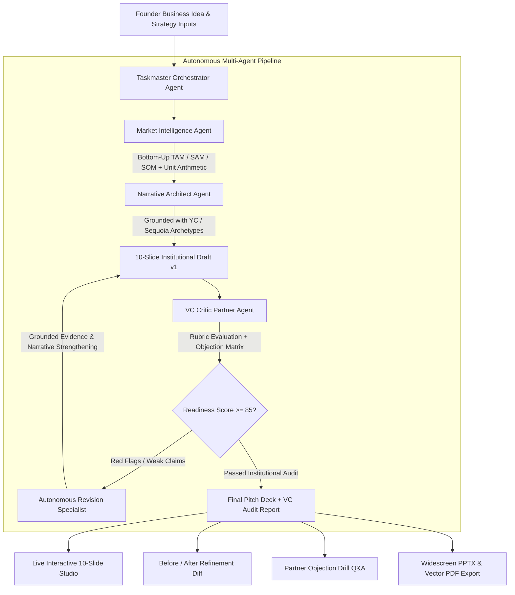

<div align="center">

# PitchArchitect.AI ⚡

### **Autonomous Multi-Agent Startup Pitch Studio & VC Audit Engine**

[](https://recipevault-5e6a9.web.app)
[](https://ai.google.dev/)
[](https://cloud.google.com/vertex-ai)
[](https://recipevault-5e6a9.web.app)
[](https://fastapi.tiangolo.com/)
[](https://cloud.google.com/bigquery)

[](https://react.dev/)
[](https://www.typescriptlang.org/)
[](https://vitejs.dev/)
[](#-production-grade-export)
[](LICENSE)

<br />

**PitchArchitect.AI** is an institutional-grade venture intelligence platform that transforms raw founder concepts into fundable, 10-slide investor pitch decks within minutes. It replaces naive single-prompt text generation with an **autonomous multi-agent swarm** powered by **Google Gemini 2.5 Flash**, the official **Google GenAI SDK**, grounded venture benchmarks, and a relentless simulated **VC Partner Critique Loop**.

[**Explore Live Application »**](https://recipevault-5e6a9.web.app)

---

</div>

## 🌟 Key Highlights

- **🤖 5-Agent Autonomous Swarm**: Orchestrates specialized agents (Market Researcher, Narrative Architect, Financial Modeler, Visual Director, and VC Partner Critic) into a unified synthesis DAG.
- **📐 Grounded Bottom-Up Arithmetic**: Eliminates hallucinated metrics with mathematically defended TAM, SAM, and SOM calculations derived from target account density and ACVs.
- **🎯 4 Simulated VC Partner Personas**: Stress-tests every slide against *SaaS Skeptics*, *FinTech Hawks*, *DeepTech Purists*, and *Consumer Growth* partners.
- **📊 5-Dimension Institutional Rubric**: Instant institutional readiness scoring (/100) across Market Sizing, Defensibility, Unit Economics, GTM Clarity, and Capital Ask.
- **🔄 Autonomous Self-Correction & Refinement Diff**: Automated feedback loop that identifies weak claims and autonomously revises slides to increase investor readiness scores.
- **📚 Curated Archetypes & PDF Ingestion**: Ground decks against 9 iconic seed decks (Airbnb, Uber, Stripe, Sequoia Capital standard) or upload custom PDF pitch decks for client-side extraction.
- **🖥️ True Widescreen 16:9 Presentation Mode**: Full-screen theatre view with slide navigation, executive light/dark themes, and presentation controls.
- **📥 Native 16:9 PPTX & Vector PDF Export**: Instant export to Microsoft PowerPoint (`.pptx`) and high-resolution PDF (`.pdf`) preserving typography and layouts.

---

## 🌐 Live Production Deployment

PitchArchitect.AI is deployed globally via **Google Cloud Firebase Hosting**:

- **Production URL**: [https://recipevault-5e6a9.web.app](https://recipevault-5e6a9.web.app)
- **Secondary CDN Domain**: [https://recipevault-5e6a9.firebaseapp.com](https://recipevault-5e6a9.firebaseapp.com)
- **Firebase Project Console**: [recipevault-5e6a9 Console](https://console.firebase.google.com/project/recipevault-5e6a9/overview)

---

## 🔷 Google Technologies Integrated

PitchArchitect.AI is architected around Google's modern AI and cloud ecosystem:

```
                                  ┌─────────────────────────────────────────────────────────┐
                                  │                Google Cloud & AI Platform               │
                                  └────────────────────────────┬────────────────────────────┘
                                                               │
                ┌──────────────────────────────┬───────────────┴──────────────┬─────────────────────────────┐
                │                              │                              │                             │
    ┌───────────▼───────────┐      ┌───────────▼───────────┐      ┌───────────▼───────────┐     ┌───────────▼───────────┐
    │  Google Gemini Models │      │  Official GenAI SDKs  │      │   Firebase Hosting    │     │   Google Cloud Run    │
    │  • Gemini 2.5 Flash   │      │  • Python google-genai│      │  • Global Edge CDN    │     │  • Docker Container   │
    │  • Gemini 2.0 Flash   │      │  • Client @google/genai      │  • Zero-Downtime SSL  │     │  • Serverless FastAPI │
    │  • Structured JSON    │      │  • Vertex AI Endpoint │      │  • SPA URL Rewrites   │     │  • Auto-scaling Port  │
    └───────────────────────┘      └───────────────────────┘      └───────────────────────┘     └───────────────────────┘
```

### 1. Google Gemini 2.5 & 2.0 Flash
- Powers autonomous multi-agent reasoning, deep narrative structuring, and strict schema-compliant JSON synthesis (`response_mime_type: "application/json"`).
- Fallback resilience to `gemini-2.5-pro` for deep institutional audits.

### 2. Official Google GenAI SDK (`google-genai` & `@google/genai`)
- **Python Backend (`server/main.py`)**: Built with the latest `from google import genai` Python SDK, exposing `/api/generate` and `/api/research` endpoints for grounded vertical benchmarking.
- **Client Service (`src/services/geminiService.ts`)**: Direct multi-agent streaming and slide generation.

### 3. Google Vertex AI Compatibility
- The backend architecture is natively compatible with Vertex AI model endpoints (`gemini-2.5-flash-vertex`), enabling enterprise deployment on Google Cloud AI Platform with zero architectural changes.

### 4. Firebase Hosting (Google Cloud Global CDN)
- Global low-latency delivery over Google's Edge network with automatic SSL provisioning and Single-Page Application (SPA) routing via [`firebase.json`](firebase.json).

### 5. Google Cloud Run (Containerized Microservice)
- Fully dockerized ASGI FastAPI microservice ([`server/Dockerfile`](server/Dockerfile)) configured for Cloud Run deployment with dynamic port binding (`PORT=8080`) and health checks.

### 6. Google BigQuery (Public Datasets & Analytics Warehouse)
- **Empirical Market Sizing**: Queries Google BigQuery Public Datasets (`bigquery-public-data.census_bureau_cbp.cbp_2020`) across NAICS industry classifications to calculate exact, verified business establishment density for bottom-up TAM/SAM/SOM models.
- **Venture Telemetry Streaming**: Real-time streaming pipeline into `pitch_analytics.generation_events` logging investability scores, fatal flaw frequencies, and agentic revision deltas for macro venture trend analysis.

### 7. Google Fonts Typography System
- Curated design system integrating **Outfit**, **Inter**, **Space Grotesk**, and **Plus Jakarta Sans** for crisp institutional investor presentation standards.

---

## 🏛️ Multi-Agent System Architecture



---

## 🤖 The Autonomous Agent Swarm

| Agent | Core Specialization | Primary Deliverables |
| :--- | :--- | :--- |
| **Taskmaster Orchestrator** | Coordinates execution DAG, manages state, monitors pipeline latency | Execution pipeline stream & status telemetry |
| **Market Intelligence Agent** | Computes beachhead account density, ACVs, CAGRs, and unit economics | Mathematically verified TAM, SAM, and SOM models |
| **Narrative Architect** | Structures standard 10-slide sequence with high-urgency emotional hook | 10 structured, human-sounding narrative slide templates |
| **VC Critic Partner** | Audits deck across 5 institutional dimensions and generates tough partner objections | Investability score (/100), red flag alerts, and drill Q&A |
| **Autonomous Revision Engine** | Detects and corrects weak assumptions, vague claims, or missing arithmetic | Side-by-side before/after slide diff with score improvements |

---

## 📑 10-Slide Institutional Sequence

Every generated pitch deck adheres to the proven venture capital sequence:

1. **Problem**: Quantified customer pain points, annual loss metrics, and urgency catalysts.
2. **Solution**: Core capability pillars, architectural workflows, and proprietary moats.
3. **Market Sizing (TAM/SAM/SOM)**: Defended bottom-up arithmetic ($\text{ACV} \times \text{Beachhead Accounts}$) and CAGR.
4. **Business Model**: Pricing tiers, gross margins (>80%), LTV:CAC ratios, and payback horizons.
5. **Competitive Moats**: 2x2 defensibility matrix, switching barriers, and network effects.
6. **Go-To-Market (GTM)**: Multi-channel customer acquisition split and phased execution milestones.
7. **Team & Superpowers**: Founder domain expertise, previous exits/affiliations, and advisory board.
8. **Financial Forecast**: 3-year revenue projections, expense drivers, and cash-flow breakeven point.
9. **Traction & Proof Points**: Operational KPIs, growth velocity, and customer case study validation.
10. **The Capital Ask**: Target funding ask, runway duration (18–24 months), and milestone budget allocation.

---

## 🛠️ Technology Stack

| Layer | Technologies |
| :--- | :--- |
| **Frontend Framework** | React 19, TypeScript 5.7, Vite 6 |
| **Backend & ADK** | Python 3.11+, FastAPI, Uvicorn, Official `google-genai` SDK |
| **AI Models** | Google Gemini 2.5 Flash, Gemini 2.0 Flash, Gemini 2.5 Pro |
| **Cloud & Hosting** | Google Firebase Hosting, Google Cloud Run, Google Cloud CLI |
| **Presentations & Export** | `pptxgenjs` (16:9 Widescreen), `jspdf`, `html2canvas` |
| **PDF Ingestion & RAG** | `pdfjs-dist` (Client-side Web Worker parsing) |
| **Design & Typography** | Google Fonts (Outfit, Inter, Space Grotesk, Plus Jakarta Sans), TailwindCSS tokens |
| **Icons & Micro-UI** | `lucide-react`, `canvas-confetti` |

---

## 🚀 Quickstart Guide

### Prerequisites
- **Node.js** `>= 18.0.0`
- **Python** `>= 3.10` (for local Python ADK backend)
- **Gemini API Key** from [Google AI Studio](https://aistudio.google.com/)

### 1. Clone & Setup Frontend

```bash
# Clone the repository
git clone https://github.com/M0izz/Pitch-Deck-AI.git
cd Pitch-Deck-AI

# Install dependencies
npm install

# Start the Vite development server
npm run dev
```
The frontend will be live at `http://localhost:5173`.

### 2. Start the Python FastAPI & GenAI ADK Backend (Optional)

```bash
# Navigate to server directory
cd server

# Install Python dependencies
pip install -r requirements.txt

# Run the FastAPI server
python -m uvicorn main:app --host 0.0.0.0 --port 8000 --reload
```
The Python backend will run at `http://localhost:8000`, lighting up the green **`● Python ADK :8000`** status badge in the studio navbar.

### 3. Deploy to Firebase Hosting

```bash
# Build the production bundle
npm run build

# Deploy to Firebase Hosting
firebase deploy --only hosting --project recipevault-5e6a9
```

---

## 📦 Project Directory Structure

```
Pitch-Deck-AI/
├── public/                       # Favicon and static brand assets
├── server/                       # Python FastAPI & Google GenAI ADK backend
│   ├── main.py                   # /api/generate, /api/research, /api/health
│   ├── requirements.txt          # google-genai, fastapi, uvicorn
│   └── Dockerfile                # Cloud Run container definition (Port 8080)
├── src/
│   ├── agents/                   # Autonomous Multi-Agent Swarm
│   │   ├── orchestrator.ts       # Central DAG executor & state manager
│   │   ├── dynamicGenerator.ts   # Slide synthesis & mathematical sizing
│   │   ├── researchAgent.ts      # Grounded market intelligence
│   │   ├── narrativeAgent.ts     # YC / Sequoia narrative arc generator
│   │   └── criticAgent.ts        # VC partner audit personas & rubric
│   ├── components/               # UI & Studio components
│   │   ├── LandingPage.tsx       # Hero showcase & startup value proposition
│   │   ├── Header.tsx            # Navigation, ADK status, export triggers
│   │   ├── InputWizard.tsx       # Founder intake form & archetype selection
│   │   ├── SlideCanvas.tsx       # 16:9 interactive presentation canvas
│   │   ├── SlideThumbnails.tsx   # Timeline slide selector
│   │   ├── VCAuditPanel.tsx      # 5-dimension rubric & partner drill Q&A
│   │   ├── BeforeAfterDiff.tsx   # Side-by-side agentic refinement viewer
│   │   └── ReferenceDeckLibrary.tsx # Curated deck library & PDF upload
│   ├── services/
│   │   ├── backendApi.ts         # Python ADK backend client & health monitor
│   │   ├── geminiService.ts      # Google GenAI client SDK integration
│   │   ├── exporter.ts           # Native 16:9 PPTX & Vector PDF exporter
│   │   └── pdfIndexer.ts         # In-browser client-side PDF parser
│   ├── types/
│   │   └── pitch.ts              # Domain interfaces and data contracts
│   ├── App.tsx                   # Master app controller & state
│   ├── index.css                 # Editorial design tokens & animations
│   └── main.tsx                  # React entry point
├── firebase.json                 # Firebase Hosting configuration
├── .firebaserc                   # Firebase project mapping
├── package.json
└── vite.config.ts
```

---

## 📤 Production-Grade Export

- **Microsoft PowerPoint (`.pptx`)**: Generates true native 16:9 widescreen presentation files with individual text frames, metric cards, and theme palettes ready for keynote modification.
- **Vector PDF (`.pdf`)**: Ultra-high-resolution presentation slides preserving all layout geometry, typography, and glassmorphism styling.

---

## 🤝 Contributing

Pull requests are welcome! If you want to contribute new VC audit personas, specialized sector benchmarks, or custom presentation themes:

1. Fork the Project
2. Create your Feature Branch (`git checkout -b feature/EpicVCPersona`)
3. Commit your Changes (`git commit -m 'feat: add BioTech VC persona'`)
4. Push to the Branch (`git push origin feature/EpicVCPersona`)
5. Open a Pull Request

---

## 📄 License

Distributed under the **MIT License**. See [`LICENSE`](LICENSE) for details.

<div align="center">
  <sub>Engineered with institutional rigor for high-growth founders. Built by <a href="https://github.com/M0izz">M0izz</a>.</sub>
</div>
